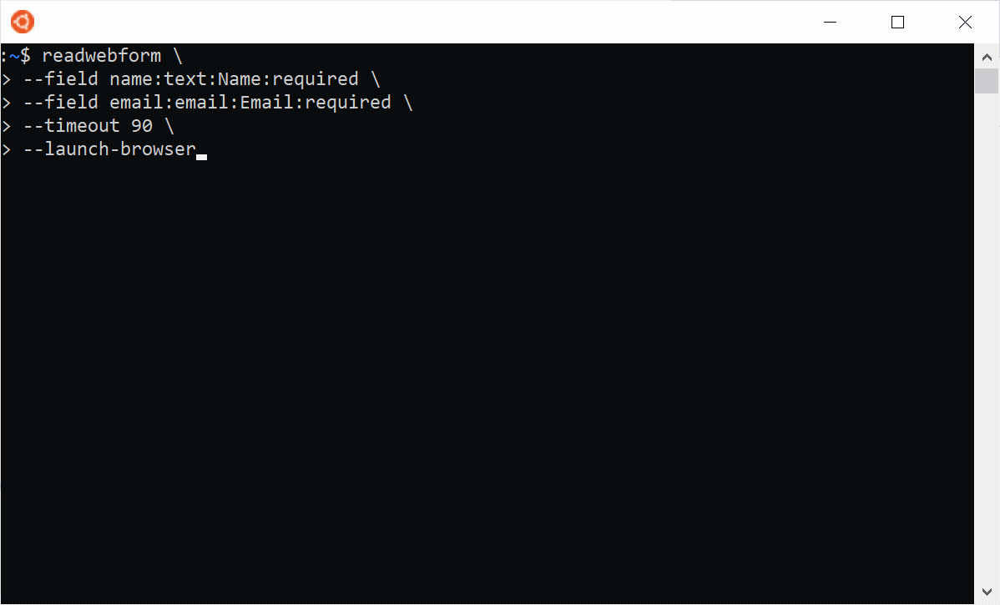

# readwebform


**Collect user input through a web form instead of the terminal.**

Interactive shell scripts are clunky. Prompting users with `read` or `readline` means no validation, no structure, and an ugly experience. What if you could pop open a real form in the browser instead?

`readwebform` launches a temporary local web server, serves a one-time form, waits for submission, then returns the data as JSON. The server shuts down automatically. Zero runtime dependencies, one command.



## Use Cases

- **Replace clunky terminal prompts** - Get structured input with validation, dropdowns, checkboxes, and file uploads instead of endless `read -p` calls
- **Collect sensitive input securely** - Passwords and API keys without terminal echo or shell history
- **Gather data from others on your network** - Send the temporary URL to a colleague; HTTPS supported for encryption
- **Human-in-the-loop for AI agents** - Provide a clean input mechanism for tools like Claude Code that need to pause and ask for user input

## Quick Start

```bash
readwebform \
  --field name:text:Name:required \
  --field email:email:Email:required \
  --launch-browser
```

The command **blocks** until the form is submitted or the timeout expires, then outputs:

```json
{
  "success": true,
  "fields": {
    "name": "Joe Smith",
    "email": "jsmith@example.com"
  },
  "files": {},
  "error": null
}
```

> **Tip:** Run `readwebform --help` to see all available options. Note that running `readwebform` with no arguments will wait for HTML input on stdin.

## Table of Contents

- [Features](#features)
- [Requirements](#requirements)
- [Installation](#installation)
- [Usage](#usage)
  - [Input Modes](#input-modes)
  - [Key Options](#key-options)
  - [Declarative Field Syntax](#declarative-field-syntax)
- [Output Formats](#output-formats)
- [Exit Codes](#exit-codes)
- [HTTPS Support](#https-support)
- [Security](#security)
- [Python API](#python-api)
- [Examples](#examples)
- [Development](#development)
- [Status](#status)
- [License](#license)
- [Contributing](#contributing)
- [Author](#author)

## Features

- **Ephemeral & Secure** - One-shot browser-based prompt with CSRF protection
- **Multiple Input Modes** - Inline HTML, HTML file, stdin, or declarative fields
- **Cross-Platform** - Works on Linux, macOS, and Windows
- **Zero Runtime Dependencies** - Uses only Python 3.9+ standard library
- **Flexible Output** - JSON or sanitized environment variables
- **File Upload Support** - With configurable size limits
- **Timeout Management** - Configurable timeouts with optional reset on validation errors
- **HTTPS Support** - Optional TLS encryption for remote access scenarios

## Requirements

- Python 3.9 or higher
- No external dependencies required at runtime

## Installation

```bash
# Clone the repository
git clone https://github.com/vlasky/readwebform.git
cd readwebform

# Install using pip
pip install .

# Or install in development mode
pip install -e .
```

> **Tip:** On Linux/macOS, pip may install the `readwebform` command to `~/.local/bin`. Ensure this directory is in your `PATH`.

## Usage

```
readwebform [options]
```

The command blocks until the form is submitted or the timeout expires. Only one submission is accepted per invocation.

### Input Modes

**Inline HTML:**
```bash
readwebform --html '<form><input name="name" required><input type="submit"></form>'
```

**Declarative fields:**
```bash
readwebform \
  --field name:text:Name:required \
  --field email:email:Email:required \
  --field comments:textarea:Comments:rows=4
```

**HTML file:**
```bash
readwebform --htmlfile ./form.html --launch-browser
```

**From stdin:**
```bash
cat form.html | readwebform
```

### Key Options

| Option | Description |
|--------|-------------|
| `--html "<string>"` | Inline HTML fragment or document containing one `<form>` element |
| `--htmlfile <path>` | Path to an HTML file containing a form |
| `--field <spec>` | Declaratively define form fields (repeatable) |
| `--title <string>` | Page title shown above the form |
| `--text <string>` | Instructional text shown above the form |
| `--host <ip>` | Host/IP to bind to (default: `127.0.0.1`) |
| `--port <int>` | TCP port (default: random available port) |
| `--cert <path>` | SSL certificate file (PEM) for HTTPS |
| `--key <path>` | SSL private key file (PEM) for HTTPS |
| `--max-file-size <limit>` | Maximum individual upload size (e.g., `5M`, `200K`) |
| `--max-total-size <limit>` | Maximum total upload size (e.g., `20M`, `1G`) |
| `--timeout <seconds>` | Max time to wait for submission (default: `300`) |
| `--reset-timeout-on-error <bool>` | Reset timeout on recoverable errors (default: true) |
| `--json` | Output result as JSON (default) |
| `--envfile <path>` | Write sanitized `export` statements to file |
| `--print-env` | Print sanitized environment variable exports to stdout |
| `--url-file <path>` | Write the form URL to this file |
| `--launch-browser [path]` | Launch default browser, or specify browser path |
| `--no-submit-button` | Disable automatic submit button in declarative mode |
| `--no-cancel-button` | Disable cancel button in declarative mode |
| `--cancel-label <text>` | Label for the cancel button (default: "Cancel") |

### Declarative Field Syntax

```
--field name:type[:label][:options]
```

Use `+` to represent spaces in labels and placeholders (e.g., `Full+Name` becomes "Full Name").

**Supported types:** `text`, `email`, `password`, `number`, `date`, `url`, `textarea`, `select`, `checkbox`, `file`

**Common options:** `required`, `placeholder=hint`, `min=0`, `max=100`, `step=1`, `rows=4`, `cols=50`, `accept=.pdf,.docx`, `multiple`, `options=a|b|c`

**Examples:**
```bash
--field name:text:Full+Name:required,placeholder=Your+name
--field age:number:Age:min=0,max=120
--field resume:file:Upload+Resume:accept=.pdf,.docx
--field country:select:Country:options=US|UK|CA,required
```

## Output Formats

### JSON (Default)

The JSON output always includes all four keys for consistent parsing:

```json
{
  "success": true,
  "fields": {
    "name": "Alice",
    "email": "alice@example.com"
  },
  "files": {
    "resume": {
      "filename": "cv.pdf",
      "path": "/tmp/readwebform_b73j3d/cv.pdf"
    }
  },
  "error": null
}
```

On timeout:
```json
{
  "success": false,
  "fields": {},
  "files": {},
  "error": "timeout"
}
```

On cancellation (user clicks Cancel button):
```json
{
  "success": false,
  "fields": {},
  "files": {},
  "error": "cancelled"
}
```

> **Note:** Timeout and cancellation are normal outcomes, not exceptions. `success: false` does not necessarily indicate an error condition.

### Environment Variables

```bash
readwebform --print-env --field name:text:Name --field email:email:Email
```

Output:
```bash
export WEBFORM_NAME='Alice'
export WEBFORM_EMAIL='alice@example.com'
```

Field names are converted to uppercase, prefixed with `WEBFORM_`, and non-alphanumeric characters are replaced with underscores.

### File Upload Cleanup

Uploaded files are stored in a temporary directory (e.g., `/tmp/readwebform_XXXX/`) and are **not automatically deleted**. Your script is responsible for cleaning up these files after processing to avoid leaving sensitive data on disk.

## Exit Codes

| Code | Meaning |
|------|---------|
| 0 | Successful submission (valid JSON on stdout) |
| 1 | Internal error |
| 2 | Invalid HTML or missing form |
| 3 | Could not read input file |
| 4 | Browser launch failure |
| 5 | Timeout waiting for submission |
| 6 | Upload size exceeded |
| 7 | User cancelled the form |
| 8 | Invalid argument |

Exit code 0 with default output mode (`--json`) guarantees valid JSON on stdout.

## HTTPS Support

For remote access scenarios where data needs to be encrypted in transit, `readwebform` supports HTTPS with user-provided certificates.

> **Note:** For typical local usage on `127.0.0.1`, HTTP is fine. HTTPS is only needed when serving forms to other machines.

### Basic HTTPS Usage

```bash
readwebform --host 0.0.0.0 --port 8443 \
  --cert server.pem --key server-key.pem \
  --field password:password:Password
```

<details>
<summary><strong>Generating Certificates</strong></summary>

**For local development (recommended): [mkcert](https://github.com/FiloSottile/mkcert)**

Creates locally-trusted certificates with no browser warnings:

```bash
# One-time setup - installs local CA
mkcert -install

# Generate certificate
mkcert localhost 127.0.0.1

# Use with readwebform
readwebform --cert localhost+1.pem --key localhost+1-key.pem --port 8443 ...
```

**Quick self-signed certificate: openssl**

Browsers will show a security warning you must click through:

```bash
openssl req -x509 -newkey rsa:2048 -keyout key.pem -out cert.pem \
  -days 365 -nodes -subj '/CN=localhost'
```

**For production servers: [Let's Encrypt](https://letsencrypt.org/)**

Use [Certbot](https://certbot.eff.org/) to obtain free trusted certificates for public domains.

</details>

### Tips

- Use a fixed `--port` (e.g., 8443) with HTTPS so browsers remember the security exception
- Self-signed certificates require clicking through browser warnings each session
- For local development, `mkcert` provides the smoothest experience

## Security

The server automatically shuts down after a single form submission.

**Security features:**

- Defaults to `127.0.0.1` (localhost only)
- HTTPS support
- CSRF token protection for each session
- User-provided HTML is served as-is; generated forms (`--field`) contain no external resources or scripts
- Stateless and ephemeral by design

## Python API

> **Note:** The Python API was added as a convenience for those who prefer to integrate `readwebform` directly into Python scripts. The primary interface is the CLI.

You can use `readwebform` as a Python library:

### Basic Usage

```python
from readwebform import read_webform

# Pass any HTML form - URL printed to stderr
result = read_webform(
    '<form><input name="email" type="email" required><button>Submit</button></form>'
)

if result.success:
    email = result.fields['email']
    print(f"User entered: {email}")
elif result.error == 'cancelled':
    print("User cancelled the form")
else:
    print(f"Form failed: {result.error}")  # e.g., 'timeout'
```

**What happens:**
1. A local web server starts on `http://127.0.0.1:<random-port>`
2. The URL is printed to stderr (open manually, or use `launch_browser=True`)
3. The function **blocks** until the user submits the form or timeout expires
4. Returns a `FormResult` with the submitted data

### Declarative Forms

```python
from readwebform import read_webform_fields

result = read_webform_fields([
    {'name': 'name', 'type': 'text', 'label': 'Full Name', 'required': True},
    {'name': 'email', 'type': 'email', 'label': 'Email', 'required': True},
    {'name': 'age', 'type': 'number', 'label': 'Age', 'min': 0, 'max': 120}
], title="User Information", timeout=120, launch_browser=True)

if result.success:
    print(f"Name: {result.fields['name']}")
    print(f"Email: {result.fields['email']}")
    print(f"Age: {result.fields['age']}")
```

### File Uploads

```python
from readwebform import read_webform
import os

html = '''
<form enctype="multipart/form-data">
    <input type="file" name="document" accept=".pdf,.txt" required>
    <button>Upload</button>
</form>
'''

result = read_webform(html, max_file_size=10*1024*1024)  # 10 MB limit

if result.success and 'document' in result.files:
    filepath = result.files['document']['path']
    filename = result.files['document']['filename']
    print(f"File saved to: {filepath}")

    # Process the uploaded file
    with open(filepath, 'rb') as f:
        content = f.read()

    # IMPORTANT: Clean up uploaded files when done
    os.remove(filepath)
```

### Available Parameters

#### `read_webform(html, **kwargs)`

| Parameter | Default | Description |
|-----------|---------|-------------|
| `html` | (required) | HTML form content (fragment or complete document) |
| `timeout` | `300` | Maximum seconds to wait for submission |
| `launch_browser` | `False` | Automatically open browser |
| `browser_path` | `None` | Path to specific browser executable |
| `max_file_size` | `None` | Maximum individual file size in bytes |
| `max_total_size` | `None` | Maximum total upload size in bytes |
| `reset_timeout_on_error` | `True` | Reset timeout on validation errors |
| `host` | `'127.0.0.1'` | Host to bind to |
| `port` | `None` | Port to bind to (default: auto-select) |

#### `read_webform_fields(fields, title=None, text=None, **kwargs)`

| Parameter | Default | Description |
|-----------|---------|-------------|
| `fields` | (required) | List of field specifications |
| `title` | `None` | Page title |
| `text` | `None` | Instructional text above form |

All other parameters same as `read_webform()`.

#### Field Specification

Each field is a dict:

```python
{
    'name': 'field_name',      # Required: field name
    'type': 'text',            # Required: text, email, password, number, date, url,
                               #           textarea, select, checkbox, file
    'label': 'Display Label',  # Optional: label shown to user
    'required': True,          # Optional: whether field is required
    'placeholder': 'hint',     # Optional: placeholder text
    'min': 0,                  # Optional: for number/date fields
    'max': 100,                # Optional: for number/date fields
    'step': 1,                 # Optional: for number fields
    'rows': 4,                 # Optional: for textarea
    'cols': 50,                # Optional: for textarea
    'options': ['A', 'B'],     # Required for select: list of choices
    'accept': '.pdf,.txt',     # Optional: for file input
}
```

### Return Value: `FormResult`

```python
class FormResult:
    success: bool                           # True if form submitted, False if timeout/cancel
    fields: Optional[Dict[str, str]]        # Field name -> value (None if not success)
    files: Optional[Dict[str, Dict]]        # File field -> {'filename': ..., 'path': ...}
    error: Optional[str]                    # 'timeout', 'cancelled', or other error
```

## Examples

### Simple Contact Form

```bash
readwebform \
  --title "Contact Information" \
  --field name:text:Name:required \
  --field email:email:Email:required \
  --field message:textarea:Message:rows=5,required \
  --launch-browser
```

### File Upload with Limits

```bash
readwebform \
  --html '<form><input type="file" name="doc" accept=".pdf"><button>Submit</button></form>' \
  --max-file-size 5M \
  --timeout 600
```

### Output to Environment File

```bash
readwebform --htmlfile form.html --envfile vars.env
source vars.env
echo "User entered: $WEBFORM_NAME"
```

### Use in Shell Script

```bash
#!/bin/bash
# Requires jq for JSON parsing: https://jqlang.github.io/jq/
result=$(readwebform --field name:text:Name:required --field age:number:Age)
name=$(echo "$result" | jq -r '.fields.name')
age=$(echo "$result" | jq -r '.fields.age')
echo "Hello $name, you are $age years old"
```

### Python: Complete Registration Form

```python
from readwebform import read_webform_fields

def get_user_registration():
    """Collect user registration data interactively."""

    fields = [
        {'name': 'username', 'type': 'text', 'label': 'Username',
         'required': True, 'placeholder': 'Choose a username'},
        {'name': 'email', 'type': 'email', 'label': 'Email Address',
         'required': True},
        {'name': 'password', 'type': 'password', 'label': 'Password',
         'required': True},
        {'name': 'age', 'type': 'number', 'label': 'Age',
         'min': 13, 'max': 120, 'required': True},
        {'name': 'country', 'type': 'select', 'label': 'Country',
         'options': ['USA', 'UK', 'Canada', 'Other'], 'required': True},
        {'name': 'bio', 'type': 'textarea', 'label': 'Bio',
         'rows': 4, 'placeholder': 'Tell us about yourself'},
        {'name': 'newsletter', 'type': 'checkbox', 'label': 'Subscribe to newsletter'},
    ]

    result = read_webform_fields(
        fields,
        title="User Registration",
        text="Please fill out the form below to register",
        timeout=300
    )

    if result.success:
        return {
            'username': result.fields['username'],
            'email': result.fields['email'],
            'password': result.fields['password'],
            'age': int(result.fields['age']),
            'country': result.fields['country'],
            'bio': result.fields.get('bio', ''),
            'newsletter': result.fields.get('newsletter') == 'on'
        }
    else:
        raise TimeoutError("User did not complete registration in time")

# Usage
try:
    user_data = get_user_registration()
    print(f"Registered user: {user_data['username']}")
except TimeoutError as e:
    print(f"Registration failed: {e}")
```

## Development

```bash
# Install in development mode with test dependencies
pip install -e ".[test]"

# Run all tests
python -m pytest tests/ -v

# Run only unit tests
python -m pytest tests/ -v --ignore=tests/test_integration.py

# Run only integration tests
python -m pytest tests/test_integration.py -v
```

### Design Document

See [SPEC.md](SPEC.md) for the full design specification. This document covers architecture, security model, validation rules, and implementation details. It's intended for contributors and anyone wanting to implement `readwebform` in another programming language.

### Test Coverage

- **150 total tests**
  - 106 unit tests (parser, forms, multipart, output, CLI)
  - 14 integration tests (end-to-end server + CLI behavior)
  - 10 threading/race condition tests
  - 10 timeout behavior tests
  - 10 HTTPS tests (using ephemeral certificates)
- Tests actual HTTP/HTTPS requests, file uploads, CSRF validation, timeouts
- HTTPS tests use `cryptography` library (test dependency only)

## Status

This is an **initial proof of concept**. The API and CLI interface may change based on user feedback. If you have suggestions or run into issues, please open an issue on GitHub.

## License

MIT License - see [LICENSE](LICENSE) file for details.

## Contributing

Contributions are welcome! Please feel free to submit a Pull Request.

## Author

**Vlad Lasky** - [https://github.com/vlasky](https://github.com/vlasky)
